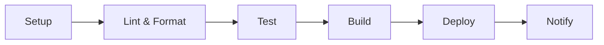

# Jarvis MVP CI/CD Pipeline

This directory contains the Continuous Integration and Continuous Deployment (CI/CD) system for the Jarvis MVP project.

## Overview

The CI/CD system is designed to ensure code quality, run tests, and automate deployment. It consists of:

1. **Local Development Checks**: Run code quality checks locally before committing.
2. **GitHub Actions**: Automated workflows that run on push/pull requests.
3. **Docker Integration**: Build and test Docker images in isolated environments.
4. **Code Quality**: Linting, formatting, and type checking.
5. **Testing**: Unit tests, integration tests, and coverage reporting.
6. **Deployment**: Automated deployment to production.
7. **Monitoring**: Pipeline visualization and status tracking.
8. **Notifications**: Real-time alerts for build and deployment status.

## Prerequisites

- Python 3.9+
- Docker (for containerization)
- pre-commit (for Git hooks)
- Git (version control)
- pip (Python package manager)
- make (for running common tasks)

## Local Development

### Setting Up the Development Environment

1. **Clone the repository** (if you haven't already):
   ```bash
   git clone <repository-url>
   cd Jarvis_MVP_Release
   ```

2. **Set up a virtual environment** (recommended):
   ```bash
   python -m venv .venv
   source .venv/bin/activate  # On Windows: .venv\Scripts\activate
   ```

3. **Install development dependencies**:
   ```bash
   pip install -r requirements-dev.txt
   ```

### Setting Up Pre-commit Hooks

Pre-commit hooks run checks before each commit. To set up:

```bash
# Install pre-commit
pip install pre-commit

# Install Git hooks
pre-commit install

# Install the hooks
pre-commit install-hooks
```

### Running the CI Pipeline Locally

You can run the entire CI pipeline or individual steps:

```bash
# Run the entire pipeline
python ci/run_pipeline.py

# Run specific steps
python ci/run_pipeline.py --setup --lint --test

# Run with verbose output
python ci/run_pipeline.py -v

# Dry run (show what would be done)
python ci/run_pipeline.py --dry-run
```

### Using Docker for CI

Run the CI pipeline in a Docker container for consistent results:

```bash
# Build the CI Docker image
./ci/run_docker_ci.sh

# Run with custom Python version
./ci/run_docker_ci.sh --python-version 3.10
```

### Checking Pipeline Status

View the current status of the CI/CD pipeline:

```bash
# Show pipeline status
python ci/pipeline_status.py

# Output in JSON format
python ci/pipeline_status.py --json
```

### Visualizing the Pipeline

Generate a visualization of the CI/CD pipeline:

```bash
# Generate PNG visualization (requires Graphviz)
python ci/visualize_pipeline.py

# Generate SVG visualization
python ci/visualize_pipeline.py --format svg
```

### Using Makefile

A `Makefile` is provided for common tasks:

```bash
# Install development dependencies
make install

# Format code
make format

# Run linters
make lint

# Run tests
make test

# Run tests with coverage
make test-cov

# Generate HTML coverage report
make test-html

# Run type checking
make mypy

# Run all checks
make check

# Build Docker image
make build

# Run the application
make run

# Clean up temporary files
make clean
```

## CI/CD Pipeline

The CI/CD pipeline consists of the following stages:

1. **Setup**: Install dependencies and set up the environment.
2. **Lint & Format**: Run linters and code formatters.
3. **Test**: Run unit and integration tests with coverage.
4. **Build**: Build Docker images and verify them.
5. **Deploy**: Deploy to staging/production environments.
6. **Notify**: Send notifications about the build status.

### Pipeline Visualization



### GitHub Actions

The pipeline runs on GitHub Actions and includes the following jobs:

1. **Lint and Type Check**: Run linters and type checkers.
2. **Test**: Run tests across multiple Python versions.
3. **Docker**: Build and test Docker image.
4. **Deploy**: Deploy to production (on push to main).

### Telegram Bot Integration

The CI/CD system includes a Telegram bot for real-time notifications and interaction. The bot provides:

- Real-time build status updates
- Interactive buttons to control the CI/CD pipeline
- Access to build logs
- Pipeline restart capability

#### Features

1. **Inline Buttons**:
   - ▶️ Перезапустить CI: Restart the CI/CD pipeline
   - 📄 Посмотреть лог: View the latest build log
   - 🔄 Обновить лог: Refresh the log view
   - 🔙 Назад: Return to the main menu

2. **Commands**:
   - `/start` - Start interacting with the bot
   - `/last_log` - Get the latest build log
   - `/restart` - Restart the CI/CD pipeline
   - `/help` - Show help message

3. **Interactive Notifications**:
   - Get notified when builds start, succeed, or fail
   - View error messages directly in Telegram
   - Access logs without leaving the chat

#### Setup Instructions

1. **Create a Telegram Bot**:
   - Talk to [@BotFather](https://t.me/botfather) on Telegram
   - Use the `/newbot` command to create a new bot
   - Save the provided bot token

2. **Get Your Chat ID**:
   - Send a message to your bot
   - Visit `https://api.telegram.org/bot<YOUR_BOT_TOKEN>/getUpdates`
   - Find your chat ID in the response

3. **Configure Environment Variables**:
   ```bash
   # Required
   TELEGRAM_BOT_TOKEN=your_bot_token_here
   TELEGRAM_CHAT_ID=your_chat_id_here
   
   # Optional - enable/disable notifications (default: true)
   CI_TELEGRAM_NOTIFY=true
   ```

4. **Set Up Webhook (Optional)**:
   For real-time updates, set up a webhook:
   ```bash
   curl -F "url=https://your-domain.com/telegram-webhook" \
        -F "secret_token=YOUR_SECRET_TOKEN" \
        https://api.telegram.org/bot<YOUR_BOT_TOKEN>/setWebhook
   ```

#### Example Interaction

```
🤖 CI/CD Бот активирован

Я буду уведомлять вас о статусе выполнения CI/CD пайплайна.

Доступные команды:
/last_log - Показать последний лог
/restart - Перезапустить CI/CD пайплайн
/help - Показать помощь

🔄 [CI] Running tests...

_Выберите действие:_
[▶️ Перезапустить CI] [📄 Посмотреть лог]
```

## Analytics & Reporting

The CI/CD system includes comprehensive analytics and reporting features to track pipeline performance, identify issues, and monitor trends over time.

### Features

- **Dashboard Overview**: Visual summary of pipeline health and performance
- **Daily/Weekly Reports**: Detailed reports on pipeline runs, success rates, and durations
- **Error Tracking**: Automatic detection and categorization of errors in pipeline logs
- **Trend Analysis**: Visualizations of pipeline performance over time
- **Automated Reports**: Daily reports delivered via Telegram

### Accessing Analytics

1. **Web Interface**: Visit `/ci/ui/analytics` in your browser
2. **API Endpoints**:
   - `GET /ci/api/analytics/daily` - Get daily analytics report
   - `GET /ci/api/analytics/weekly` - Get weekly analytics report
   - `POST /ci/api/analytics/process` - Process new pipeline data

### Automated Reports

Daily reports are automatically generated at 9:00 AM and sent to the configured Telegram chat. The report includes:

- Total number of pipeline runs
- Success/failure rates
- Average duration
- Top errors and warnings
- Comparison with previous period

### Configuration

Set these environment variables to enable analytics features:

```env
# Enable analytics
ENABLE_ANALYTICS=true

# Telegram bot configuration (for reports)
TELEGRAM_BOT_TOKEN=your_bot_token
TELEGRAM_CHAT_ID=your_chat_id

# Web UI authentication
UI_ADMIN_TOKEN=your_secure_token
```

## Web Dashboard

The CI/CD system includes a web dashboard for monitoring and controlling the pipeline.

### Features

- 📊 **Dashboard Overview**: View the status of the latest pipeline runs
- 📈 **Analytics**: Track pipeline performance and trends over time
- 🔍 **Logs**: Access and download logs from previous runs
- ⚡ **Quick Actions**: Manually trigger pipeline runs with custom steps
- 🔒 **Secure**: Token-based authentication for all endpoints
- 📊 **Reports**: Generate and export detailed analytics reports

### Accessing the Dashboard

1. **Start the services**:
   ```bash
   docker-compose up -d web-ui
   ```

2. **Open in browser**:
   ```
   http://localhost:8000/ci/ui?token=your_ui_admin_token
   ```
   Replace `your_ui_admin_token` with the value from your `.env` file.

### API Authentication

All API endpoints require the `X-Admin-Token` header:

```bash
curl -H "X-Admin-Token: your_ui_admin_token" http://localhost:8000/ci/api/status
```

### Environment Variables

| Variable | Description | Default |
|----------|-------------|---------|
| `UI_ADMIN_TOKEN` | Token for accessing the web UI | *required* |
| `WEBHOOK_PORT` | Port for the web UI | `8000` |

## Automatic CI Triggering

The CI/CD system can be automatically triggered by webhooks from GitHub or GitLab. This allows for automatic builds and tests whenever code is pushed or pull requests are opened.

### Webhook Configuration

#### GitHub Setup

1. Go to your repository on GitHub
2. Navigate to "Settings" > "Webhooks" > "Add webhook"
3. Set the following values:
   - **Payload URL**: `https://your-domain.com/ci/webhook`
   - **Content type**: `application/json`
   - **Secret**: The same as `WEBHOOK_SECRET` in your `.env` file
   - **Which events**: Select "Let me select individual events" and choose:
     - Push events
     - Pull request events
4. Click "Add webhook"

#### GitLab Setup

1. Go to your repository on GitLab
2. Navigate to "Settings" > "Webhooks"
3. Set the following values:
   - **URL**: `https://your-domain.com/ci/webhook`
   - **Secret Token**: The same as `WEBHOOK_SECRET` in your `.env` file
   - **Trigger**: Select "Push events" and "Merge request events"
4. Click "Add webhook"

### Environment Variables

Add these to your `.env` file:

```bash
# Webhook Configuration
WEBHOOK_SECRET=your_secure_webhook_secret  # Must match the secret in your Git provider
MAIN_BRANCH=main  # The main branch that triggers full CI pipeline
WEBHOOK_PORT=8000  # Port for the webhook server
```

### Running the Webhook Server

#### Using Docker Compose (Recommended)

```bash
docker-compose up -d webhook
```

#### Manually

```bash
# Install dependencies
pip install -r requirements.txt

# Start the webhook server
python -m ci.webhook
```

### Testing the Webhook

1. Start the webhook server
2. Make a test push to your repository
3. Check the server logs for incoming webhooks
4. Verify that the CI pipeline starts automatically

### Security Considerations

- Always use HTTPS for your webhook endpoint
- Keep your `WEBHOOK_SECRET` secure and never commit it to version control
- Consider setting up IP whitelisting for additional security
- Monitor webhook deliveries for any suspicious activity

### GitHub Secrets

The following secrets need to be configured in your GitHub repository:

- `CODECOV_TOKEN`: Token for uploading coverage reports to Codecov
- `DOCKERHUB_USERNAME`: Docker Hub username for pushing images
- `DOCKERHUB_TOKEN`: Docker Hub access token
- `SSH_PRIVATE_KEY`: Private key for deployment
- `PRODUCTION_HOST`: Production server hostname
- `PRODUCTION_USER`: Username for production server
- `TELEGRAM_BOT_TOKEN`: Token for Telegram bot (get from @BotFather)
- `TELEGRAM_CHAT_ID`: Your Telegram chat ID (get from /getUpdates)
- `WEBHOOK_SECRET`: Secret for securing webhook payloads

## Code Quality

### Linting and Formatting

- **Black**: Code formatting.
- **isort**: Import sorting.
- **Ruff**: Fast Python linter.
- **mypy**: Static type checking.

### Testing

- **pytest**: Test framework.
- **pytest-cov**: Coverage reporting.
- **pytest-xdist**: Parallel test execution.

### Pre-commit Hooks

Pre-commit hooks run the following checks:

- Black formatting
- isort import sorting
- Ruff linting
- mypy type checking
- Various pre-commit hooks (see `.pre-commit-config.yaml`)

## Logs and Reports

- **Logs**: Detailed logs from CI runs are stored in the `ci/logs` directory.
- **Reports**: Test coverage and other reports are generated in the `ci/reports` directory.
- **Artifacts**: Build artifacts are stored in the `dist` directory.

### Viewing Logs

```bash
# View the latest CI log
cat ci/logs/$(ls -t ci/logs/ | head -1)

# Follow the log in real-time
tail -f ci/logs/$(ls -t ci/logs/ | head -1)
```

## Troubleshooting

### Common Issues

1. **Black/isort conflicts**: Run `make format` to fix formatting issues.
2. **Type errors**: Fix type hints or add `# type: ignore` comments if necessary.
3. **Docker build failures**: Ensure `Dockerfile` is correct and all dependencies are listed.

### Getting Help

If you encounter issues, please:

1. Check the logs in `ci/logs`.
2. Run checks locally with `-v` for verbose output.
3. Open an issue with details about the problem.

## Maintenance

### Updating Dependencies

To update Python dependencies:

```bash
# Update all dependencies
pip list --outdated
pip install -U -r requirements-dev.txt

# Generate new requirements files
pip freeze > requirements.txt
```

### Cleaning Up

Clean up temporary files and Docker resources:

```bash
# Clean Python artifacts
python ci/cleanup_ci.py --python

# Clean Docker resources
python ci/cleanup_ci.py --docker

# Clean everything
python ci/cleanup_ci.py --all

# Clean virtual environment
python ci/cleanup_ci.py --venv .venv
```

## License

This project is licensed under the MIT License. See the `LICENSE` file for details.

## Contributing

Contributions are welcome! Please follow these steps:

1. Fork the repository
2. Create a feature branch (`git checkout -b feature/amazing-feature`)
3. Commit your changes (`git commit -m 'Add some amazing feature'`)
4. Push to the branch (`git push origin feature/amazing-feature`)
5. Open a Pull Request

## Support

For support, please open an issue on the GitHub repository.
